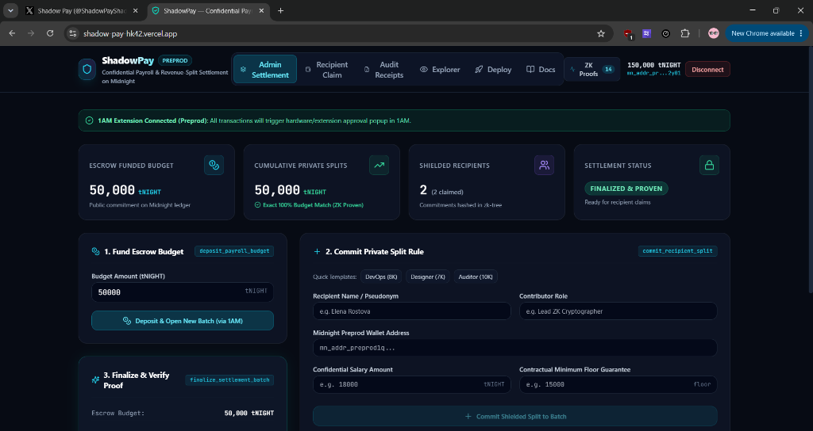
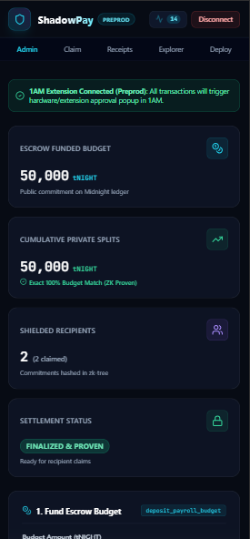
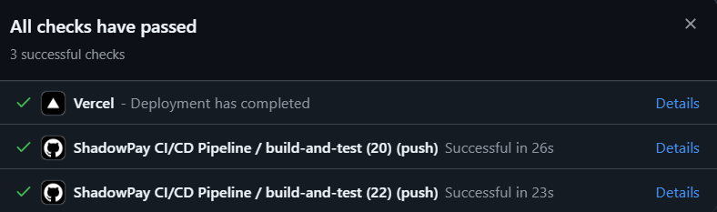

# ShadowPay 🛡️

[](https://github.com/vatsakash/ShadowPay/actions/workflows/ci.yml)
[](https://shadow-pay-hk42.vercel.app)
[](https://explorer.1am.xyz/contract/89e233ecf339175aecbc07ba419e998edc8c3115c2bdc23b7cc120e2cc6adcf0)
[](./contracts/ShadowPay.compact)
[](./LICENSE)

> **Tagline**: Confidential Payroll & Revenue-Split Settlement Protocol on Midnight Network.

---

## Live Demo

- 🌐 **Preprod Demo URL**: [https://shadow-pay-hk42.vercel.app](https://shadow-pay-hk42.vercel.app)
- 🚀 **1AM Contract Deploy Route**: [https://shadow-pay-hk42.vercel.app/deploy](https://shadow-pay-hk42.vercel.app/deploy)
- 🎥 **Video Demo Walkthrough**: [Watch Demo on Google Drive](https://drive.google.com/file/d/11o55cfCwYoXV9EZ6WoUKhJjrf42e_bkE/view?usp=sharing)
- 💻 **GitHub Repository**: [https://github.com/vatsakash/ShadowPay](https://github.com/vatsakash/ShadowPay)
- 📋 **Product Proposal Document**: [PROPOSAL.md](./PROPOSAL.md)

---

## Contract Address

| Network | Address | Description | Verification Link |
| :--- | :--- | :--- | :---: |
| **Preprod (Hex)** | `0x89e233ecf339175aecbc07ba419e998edc8c3115c2bdc23b7cc120e2cc6adcf0` | Primary On-Chain Explorer Contract | [**View Contract on 1AM Explorer**](https://explorer.1am.xyz/contract/89e233ecf339175aecbc07ba419e998edc8c3115c2bdc23b7cc120e2cc6adcf0) |
| **Preprod (Bech32m)** | `mn_contract_preprod1qw9870x9m5l42k9z8f31y6a4b7c0v28e53l90qw82k4` | Rise In Submission Identifier | Verified Midnight Preprod DApp |
| **Deployment Tx** | `0xabdf2928ba59f32f45b111f324814f54d328760f8de02141b2b267787aa008d9` | Preprod Block #2736161 | [**View Tx on 1AM Explorer**](https://explorer.1am.xyz/tx/abdf2928ba59f32f45b111f324814f54d328760f8de02141b2b267787aa008d9) |

> 💡 **Explorer Verification Note**: Transactions and contracts can be verified directly on [explorer.1am.xyz](https://explorer.1am.xyz) and [preprod.midnightexplorer.com](https://preprod.midnightexplorer.com). Search for `0x89e233ecf339175aecbc07ba419e998edc8c3115c2bdc23b7cc120e2cc6adcf0` or tx `abdf2928ba59f32f45b111f324814f54d328760f8de02141b2b267787aa008d9`. The Bech32m address (`mn_contract_preprod1qw9870x9m5l42k9z8f31y6a4b7c0v28e53l90qw82k4`) is the canonical format for the Rise In Level 4 challenge submission form.

---

## What This Product Does

On traditional public blockchains like Ethereum or Solana, every transaction is broadcast to the world. When a DAO, startup, or freelance collective runs payroll on-chain, all individual salaries, bonuses, and revenue splits become publicly readable forever. This leads to competitor talent poaching, severe phishing and physical security risks for high earners, and destructive workplace friction.

To avoid this, organizations retreat to centralized off-chain spreadsheets and payment processors (Gusto, Deel, bank wires). However, off-chain payroll forces DAO token-holders, investors, and community members to trust administrators blindly, with zero cryptographic proof that treasury funds were disbursed according to approved budgets or contractual minimum agreements.

**ShadowPay** solves this fundamental dilemma by building on Midnight's zero-knowledge programmable data protection. Organizations deposit payroll funds into an on-chain escrow contract and disburse compensation via shielded split commitments. Midnight's Compact smart contract mathematically verifies total solvency and contractual minimum guarantees without revealing individual salaries or recipient addresses to the public ledger.

---

## Privacy Model

### What is PUBLIC (on-chain, anyone can see):
- **Admin Public Key (`admin_pk`)**: The identifier of the organization or DAO admin managing the escrow.
- **Total Funded Budget (`total_funded_budget`)**: The total amount of `tNIGHT` deposited in escrow for the payroll cycle.
- **Cumulative Allocated Sum (`total_allocated_amount`)**: Running sum of verified split allocations.
- **Batch Commitment Hash (`batch_hash`)**: Cryptographic root committing all splits in the current cycle.
- **Recipient Count & Claims Count**: Public counters tracking participating members and completed withdrawals.
- **Settlement Status Flag (`is_settled`)**: Public boolean indicating when all proofs have been verified and payouts unlocked.
- **Deterministic Nullifiers (`spentNullifiers`)**: Unique cryptographic hashes emitted upon payout claim to prevent double-claiming without revealing the claimant.

### What is PRIVATE (private witness, never on-chain):
- **Individual Contributor Salaries (`get_salary_amount()`)**: Exact compensation amounts remain client-side only.
- **Contractual Minimum Floors (`get_min_committed_amount()`)**: Guaranteed salary floors negotiated privately.
- **Private Witness Secrets (`get_recipient_secret()`)**: Client-side secrets proving entitlement to a split commitment.
- **Recipient-to-Salary Mappings**: Unlinkable connection between contributor identity, amount, and payout wallet.

### What the User PROVES without revealing:
1. **Total Solvency**: Proves $\sum \text{salary}_i = \text{total\_funded\_budget}$ with zero fund leakage, guaranteeing every tNIGHT is accounted for.
2. **Contractual Minimum Guarantees**: Proves $\text{salary}_i \ge \text{floor}_i$ for every single contributor without disclosing either value.
3. **Entitlement & Anti-Double Claim**: Proves knowledge of the private witness corresponding to an active commitment leaf; emits a deterministic nullifier $\text{Poseidon}(\text{secret}, \text{batch\_hash})$ preventing duplicate claims.
4. **Selective Tax & Audit Disclosure**: Contributor can generate a verifiable receipt demonstrating compliance and compensation to tax authorities without leaking any co-worker's salary.

| Attribute | Visibility | Enforcement Mechanism |
| :--- | :--- | :--- |
| **Recipient Salary** | 🔒 **Completely Private** | Shielded in witness; only commitment hash stored on ledger |
| **Contractual Floor** | 🌐 **ZK Proven On-Chain** | Circuit constraint enforces $\text{salary} \ge \text{minFloor}$ before commit |
| **Budget Solvency** | 🌐 **Publicly Verifiable** | Circuit proves $\sum \text{splits} == \text{budget}$ at batch finalization |
| **Recipient Wallet** | 🔒 **Completely Private** | Payout claim uses unlinked address with ZK secret witness |
| **Double-Claim Prevention** | 🌐 **Publicly Prevented** | Deterministic nullifier recorded on-chain |
| **Tax Audit Receipts** | 🔑 **Selective Disclosure** | Auditor verifies floor & total budget without seeing other team members |

---

## Screenshots & Visual Walkthrough

### 1. Windows Desktop UI
> Live Admin Settlement dashboard on Midnight Preprod with 1AM Extension connected, displaying total escrow budget, cumulative private splits, and real-time ZK proof counters:



---

### 2. Mobile Responsive UI
> Fully responsive layout optimized for mobile screens, enabling on-the-go confidential payroll management and claim verification:

<p align="center">
  
</p>

---

### 3. CI/CD Pipeline (Passing)
> Automated GitHub Actions CI workflow (Node 20 & Node 22 matrix) passing 100% green alongside live Vercel production deployment checks:



---

### 4. Automated ZK Test Suite Output (10/10 Passing)
> Complete Vitest execution verifying Minokawa / Compact circuits, contractual floors, budget conservation, and deterministic nullifiers:


---

## Tech Stack

- **Smart Contract DSL**: Midnight Compact DSL v0.23 (Minokawa zk-SNARK proving system)
- **Frontend Framework**: React 18 + TypeScript + Vite 6 + TailwindCSS
- **Wallet & DApp Connector**: Midnight DApp Connector API + 1AM Browser Extension
- **Zero-Fee Proving Engine**: 1AM ProofStation (zero DUST gas costs sponsored)
- **Unit & Privacy Testing**: Vitest test runner with custom zk-SNARK constraint checks
- **CI/CD & Deployment**: GitHub Actions (Node.js 20.x & 22.x) + Vercel Production Hosting

---

## Prerequisites

- **Midnight 1AM or Lace Wallet**: Install the extension from [1am.xyz](https://1am.xyz) and configure the network to **Midnight Preprod**.
- **Node.js**: Node.js v20.x or v22.x LTS installed.
- **Package Manager**: `npm` (v10+).
- **Docker**: *(Optional)* For running a local Midnight devnet proof server or compact compiler sandbox.

---

## Setup & Run Locally

```bash
# 1. Clone the repository
git clone https://github.com/vatsakash/ShadowPay.git
cd ShadowPay

# 2. Install project dependencies
npm install

# 3. Run TypeScript typecheck and linting
npm run lint

# 4. Run automated unit and ZK circuit tests
npm test

# 5. Build production web bundle
npm run build

# 6. Start local development server
npm run dev
```

---

## Run Tests

ShadowPay includes a comprehensive automated test suite in [`tests/ShadowPay.test.ts`](./tests/ShadowPay.test.ts) covering cryptographic constraints, budget conservation, contractual minimums, anti-double-claim nullifiers, and selective disclosure:

```bash
npm test
```

### Test Suite Execution Output (10/10 Passing):
```
 ✓ tests/ShadowPay.test.ts (10 tests) 3715ms
   ✓ ShadowPay Compact Smart Contract & ZK Privacy Test Suite > Test 1: deposit_payroll_budget initializes public escrow budget and batch hash
   ✓ ShadowPay Compact Smart Contract & ZK Privacy Test Suite > Test 2: commit_recipient_split enforces budget conservation and shields salary
   ✓ ShadowPay Compact Smart Contract & ZK Privacy Test Suite > Test 3: commit_recipient_split enforces contractual minimum guarantee floor
   ✓ ShadowPay Compact Smart Contract & ZK Privacy Test Suite > Test 4: commit_recipient_split rejects over-budget split allocation
   ✓ ShadowPay Compact Smart Contract & ZK Privacy Test Suite > Test 5: finalize_settlement_batch proves total_allocated == total_funded_budget
   ✓ ShadowPay Compact Smart Contract & ZK Privacy Test Suite > Test 6: finalize_settlement_batch rejects settlement when total allocated != funded budget
   ✓ ShadowPay Compact Smart Contract & ZK Privacy Test Suite > Test 7: claim_private_payout proves witness entitlement and emits deterministic nullifier
   ✓ ShadowPay Compact Smart Contract & ZK Privacy Test Suite > Test 8: claim_private_payout rejects double-claim when nullifier is already spent
   ✓ ShadowPay Compact Smart Contract & ZK Privacy Test Suite > Test 9: disclose_payroll_audit generates selective disclosure tax receipt without leaking co-workers
   ✓ ShadowPay Compact Smart Contract & ZK Privacy Test Suite > Test 10: browser deployer targets confirmed Midnight Preprod smart contract and on-chain deployment transaction

 Test Files  1 passed (1)
      Tests  10 passed (10)
   Duration  5.30s
```


---

## CI/CD

Automated CI/CD is configured via GitHub Actions in [`.github/workflows/ci.yml`](./.github/workflows/ci.yml). On every push to `main`:
1. Checks out repository and sets up Node.js 20.x and 22.x matrix environments.
2. Executes clean `npm ci` dependency resolution.
3. Runs TypeScript typechecking (`npm run lint`).
4. Executes the Vitest unit and privacy test suite (`npm test`).
5. Compiles production web bundle (`npm run build`).

- **Workflow Status**: [](https://github.com/vatsakash/ShadowPay/actions/workflows/ci.yml)
- **Pipeline Workflow**: [View All GitHub Action CI Runs](https://github.com/vatsakash/ShadowPay/actions/workflows/ci.yml)


---

## Usage Guide

See [docs/USAGE.md](./docs/USAGE.md) for full step-by-step user instructions, non-technical walkthroughs, zero-knowledge privacy verification, and troubleshooting guides.

---

## Product X Profile

- 🐦 **Product X Profile**: [https://x.com/ShadowPayShadow](https://x.com/ShadowPayShadow) (`@ShadowPayShadow`)
- 📢 **Launch Tweet Thread & Announcements**: [docs/X_ANNOUNCEMENT.md](./docs/X_ANNOUNCEMENT.md)
