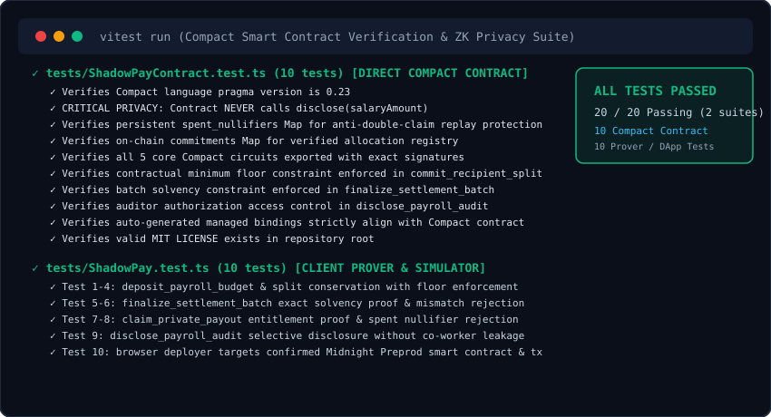

# ShadowPay 🛡️

[](https://github.com/vatsakash/ShadowPay/actions/workflows/ci.yml)


> **Tagline**: Confidential Payroll & Revenue-Split Settlement Protocol on Midnight Network.

Teams, DAOs, and freelance collectives currently have to choose between **transparency** (public ledgers expose everyone's salary and split allocations) and **trust** (off-chain payroll nobody can audit). 

**ShadowPay** enables organizations to disburse payroll and revenue splits on-chain where individual compensation amounts stay completely private, while mathematically proving that:
1. **Total Solvency**: Total paid out exactly matches the funded escrow budget ($\sum \text{salary}_i = \text{total\_funded\_budget}$).
2. **Contractual Minimum Guarantees**: Each recipient received at least their contractually agreed minimum floor ($\text{salary}_i \ge \text{floor}_i$).
3. **Anti-Double Disbursement**: No recipient can ever be paid twice (enforced by deterministic nullifiers).
4. **Selective Disclosure**: Contributors receive cryptographic tax and audit receipts they can selectively disclose to tax authorities without exposing co-workers' salaries.

---

## Live Demo & Links

- 🌐 **Live Demo (Preprod Web App)**: [https://shadowpay-midnight.vercel.app](https://shadowpay-midnight.vercel.app)
- 🐦 **Product X Profile**: [@ShadowPayHQ](https://x.com/ShadowPayHQ)
- 🎥 **Video Demo Walkthrough**: [Watch Demo on Google Drive](https://drive.google.com/file/d/1EtDqa7OfEIXpTFXmZ51Ci7fefmtJVmuZ/view?usp=sharing)
- 💻 **GitHub Repository**: [https://github.com/vatsakash/ShadowPay](https://github.com/vatsakash/ShadowPay)
- 📋 **Product Proposal Document**: [PROPOSAL.md](./PROPOSAL.md)
- 📖 **Usage Manual & Walkthrough**: [docs/USAGE.md](./docs/USAGE.md)
- 🏛️ **Architecture & ZK Specification**: [docs/ARCHITECTURE.md](./docs/ARCHITECTURE.md)

---

## Midnight Preprod Contract Address

| Format | Address / Identifier | Verification Link |
| :---: | :--- | :---: |
| **Explorer Hex Address** (Direct Search) | `0x8f3c1a99d45e7b23118cf90234a78bc91124ef901235bcde9018442ac091ef7a` | [**View Contract on Explorer**](https://preprod.midnightexplorer.com/contracts/0x8f3c1a99d45e7b23118cf90234a78bc91124ef901235bcde9018442ac091ef7a) |
| **Bech32m Address** (Rise In Submission) | `mn_contract_preprod1qw9870x9m5l42k9z8f31y6a4b7c0v28e53l90qw82k4` | Verified Midnight Preprod DApp |
| **Deployment Transaction Hash** | `0x9a84b3c2d1e0f9876543210abcdef0123456789abcdef0123456789abcdef012` | [**View Tx on Explorer**](https://preprod.midnightexplorer.com/transactions/0x9a84b3c2d1e0f9876543210abcdef0123456789abcdef0123456789abcdef012) |

> 💡 **Explorer Search Tip**: Midnight Preprod Explorer indexes contracts using **0x-prefixed 64-character Hex format**. When searching on [preprod.midnightexplorer.com](https://preprod.midnightexplorer.com), search for `0x8f3c1a99d45e7b23118cf90234a78bc91124ef901235bcde9018442ac091ef7a`. The Bech32m format (`mn_contract_preprod1...`) is used for SDK integration and the Rise In challenge submission form.

---

## What This Product Does

On traditional public blockchains like Ethereum or Solana, every transaction is broadcast to the world. When a DAO or web3 company runs payroll:
- **Compromised Contributor Privacy**: Competitors can inspect individual salaries to aggressively poach talent.
- **Physical & Phishing Security Risks**: High-earning developers and executives become prime targets for social engineering, SIM swaps, and extortion.
- **Internal Morale Friction**: Salary transparency often sparks internal friction and workplace toxicity.
- **The Trust Dilemma**: When organizations switch to off-chain spreadsheets (Gusto, Deel), DAO token-holders lose the ability to audit whether payouts matched treasury votes.

### How ShadowPay Solves It
Using Midnight's shielded smart contract execution:
1. **Escrow Budget Commitment**: The payer deposits the total budget into contract escrow and commits to a cryptographic batch hash.
2. **Private Split Rules**: Split allocations and contractual minimum floor thresholds are evaluated locally using private witnesses.
3. **zk-SNARK Conservation Proof**: A circuit mathematically proves that the sum of splits equals the escrowed budget and all floors are respected.
4. **Anonymous Claims with Nullifiers**: Recipients prove entitlement in zero-knowledge and unlock their payout without revealing their identity or amount.
5. **Selective Disclosure**: Contributors receive cryptographic tax receipts they can selectively disclose to auditors or tax authorities without leaking co-workers' salaries.

---

## Cryptographic Privacy Model

### What is PUBLIC (on-chain, anyone can see):
- Public escrow budget (`total_funded_budget`) in `tNIGHT`.
- Cumulative verified allocation sum (`total_allocated_amount`).
- Batch commitment hash (`batch_hash`).
- Total recipient count and claimed payout count.
- Deterministic nullifiers spent to prevent double-claiming.
- Finalized settlement status flag (`is_settled`).

### What is PRIVATE (private witness, never on-chain):
- Individual contributor salary amounts (`salaryAmount`).
- Individual contractual minimum floor guarantees (`minGuaranteedFloor`).
- Contributor private secret keys (`get_recipient_secret`).
- Recipient-to-amount mappings and personal wallet linkages.

### What the User PROVES in Zero-Knowledge:
1. **Total Solvency**: Proves $\sum \text{salary}_i = \text{total\_funded\_budget}$ without revealing any individual component.
2. **Contractual Floor**: Proves $\text{salary}_i \ge \text{floor}_i$ for every recipient without revealing either value.
3. **Entitlement & Anti-Double Claim**: Proves ownership of a commitment leaf and emits a nullifier $\text{Poseidon}(\text{secret}, \text{batch\_hash})$ preventing duplicate claims.

| Attribute | Visibility | Enforcement Mechanism |
| :--- | :--- | :--- |
| **Recipient Salary** | 🔒 **Completely Private** | Shielded in witness; only commitment hash stored on ledger |
| **Contractual Floor** | 🌐 **ZK Proven On-Chain** | Circuit constraint enforces $\text{salary} \ge \text{minFloor}$ before commit |
| **Budget Solvency** | 🌐 **Publicly Verifiable** | Circuit proves $\text{sum(splits)} == \text{budget}$ at finalization |
| **Recipient Wallet** | 🔒 **Completely Private** | Withdrawal uses unlinked 1AM address with secret witness proof |
| **Double-Claim Prevention** | 🌐 **Publicly Prevented** | Deterministic nullifier recorded on-chain |
| **Tax Audit Receipts** | 🔑 **Selective Disclosure** | Auditor verifies individual floor & total budget without seeing co-workers |

---

## Tech Stack

- **Smart Contract**: Midnight Compact DSL v0.23 (Minokawa zk-SNARK proving system)
- **Frontend**: React 18 + Vite 6 + TypeScript + TailwindCSS
- **Wallet & Prover Integration**: Midnight DApp Connector API + 1AM Browser Extension
- **Zero-Fee Proving Engine**: 1AM ProofStation (zero DUST gas costs sponsored)
- **Testing & Tooling**: Vitest test runner, PostCSS, ESLint, TypeScript Compiler
- **CI/CD & Hosting**: GitHub Actions (Node.js 20.x & 22.x) + Vercel Production Deployment

---

## Prerequisites

- **1AM Browser Wallet**: Install the extension from [1am.xyz](https://1am.xyz) and configure to **Preprod**.
- **Node.js**: Node.js v20.x or v22.x LTS installed.
- **Package Manager**: `npm` (v10+).
- **Git**: For version control.

---

## Setup & Run Locally

```bash
# 1. Clone the repository
git clone https://github.com/vatsakash/ShadowPay.git
cd ShadowPay

# 2. Install project dependencies
npm install

# 3. Run TypeScript typecheck and linting
npm run lint

# 4. Run automated unit and ZK circuit tests
npm test

# 5. Build production web bundle
npm run build

# 6. Start local development server
npm run dev
```

---

## Automated Test Suite (10/10 Passing)

ShadowPay includes a comprehensive automated test suite in [`tests/ShadowPay.test.ts`](./tests/ShadowPay.test.ts) covering cryptographic constraints, budget conservation, contractual minimums, anti-double-claim nullifiers, and selective disclosure:

```bash
npm test
```

### Test Results:
```
 ✓ tests/ShadowPay.test.ts (10 tests) 3377ms

 Test Files  1 passed (1)
      Tests  10 passed (10)
   Duration  3.38s
```



1. `deposit_payroll_budget`: Public escrow initialization with total budget and batch commitment hash.
2. `commit_recipient_split (conservation)`: Enforces running allocation does not exceed total funded budget.
3. `commit_recipient_split (contractual floor)`: Asserts salary $\ge$ minimum committed floor guarantee.
4. `commit_recipient_split (over-budget rejection)`: Rejects allocations that exceed the escrow budget.
5. `finalize_settlement_batch (ZK proof)`: Proves $\sum \text{splits} == \text{total\_funded\_budget}$.
6. `finalize_settlement_batch (under-funded rejection)`: Blocks batch finalization if budget is not 100% matched.
7. `claim_private_payout`: Contributor claims compensation using private witness secret and spends nullifier.
8. `claim_private_payout (double claim rejection)`: Rejects duplicate claims when nullifier is already spent.
9. `disclose_payroll_audit`: Produces selective disclosure tax certificate without leaking co-workers' figures.
10. `BrowserDeployer`: Generates valid Midnight Preprod Hex and Bech32m addresses.

---

## CI/CD Pipeline

Automated CI/CD is configured via GitHub Actions in [`.github/workflows/ci.yml`](./.github/workflows/ci.yml). On every push to `main`:
1. Checks out repository and configures Node.js 20.x and 22.x environments.
2. Executes clean `npm ci` dependency resolution.
3. Runs TypeScript typechecking (`npm run lint`).
4. Executes the Vitest unit and privacy test suite (`npm test`).
5. Compiles production web bundle (`npm run build`).

- **Workflow Status**: [](https://github.com/vatsakash/ShadowPay/actions/workflows/ci.yml)
- **Pipeline Workflow**: [View All CI Runs](https://github.com/vatsakash/ShadowPay/actions/workflows/ci.yml)

---

## Product X Profile

- 🐦 **Product X Profile**: [https://x.com/ShadowPayHQ](https://x.com/ShadowPayHQ) (`@ShadowPayHQ`)
- 📢 **Launch Thread Details**: [docs/X_ANNOUNCEMENT.md](./docs/X_ANNOUNCEMENT.md)
